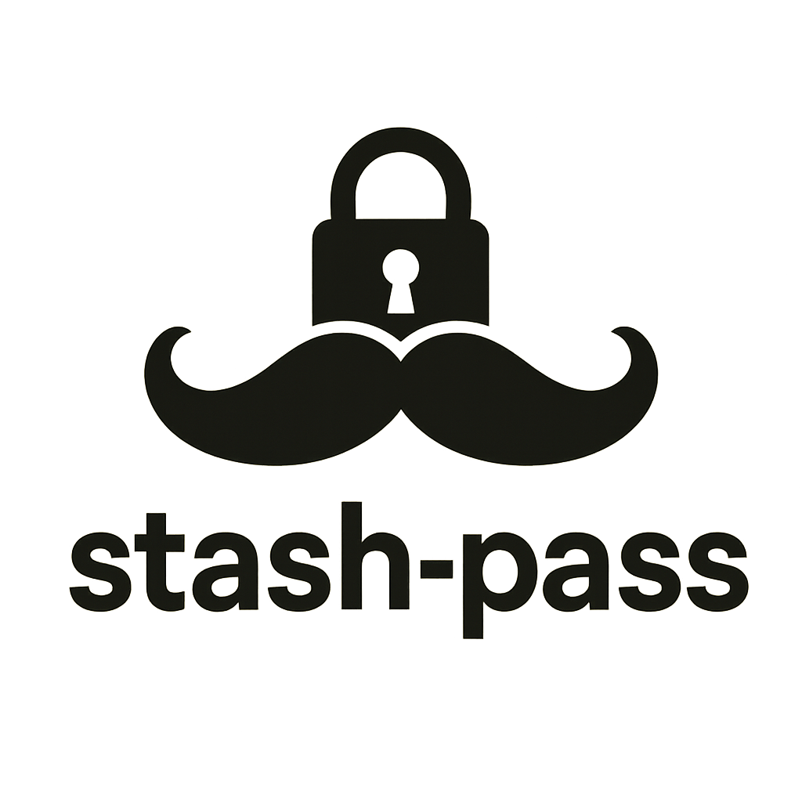

# Stash Pass CLI



Stash Pass is a command-line tool for securely managing your passwords locally. All data is encrypted using a master password and never leaves your machine.

## Features

- Secure, local password storage using strong encryption (Fernet/AES)
- Simple CLI for adding, retrieving, listing, and deleting passwords
- Master password protection

## Local Installation

1. Clone this repository:
	```bash
	git clone https://github.com/mrjaketomlinson/stash-pass-cli.git
	cd stash-pass-cli
	```
2. Install dependencies:
	```bash
	uv sync
	```
3. Build
	```bash
	uv build
	```
3. Install as a CLI tool:
	```bash
	pipx install dist/*.whl
	```

## Usage

### Initialize Master Password

Set your master password (only needed once):

```bash
stash-pass settings set-master-password
```

### Add a Password

```bash
stash-pass vault add <account_name>
```

### Retrieve a Password

```bash
stash-pass vault get <account_name>
```

### List All Accounts

```bash
stash-pass vault list
```

### Delete an Account

```bash
stash-pass vault delete <account_name>
```

### Change Master Password

```bash
stash-pass settings change-master-password
```

### Update Settings

*This doesn't have any value at present, but the functionality is there. The idea is that there will be settings which need to be configured for the CLI tool, and this is how it will be managed.*

```bash
stash-pass settings update <setting> <value>
```

## Security Notes

- All passwords are encrypted locally using a key derived from your master password.
- The master password is never stored.
- Make sure to remember your master password; lost passwords cannot be recovered.

## License

MIT License